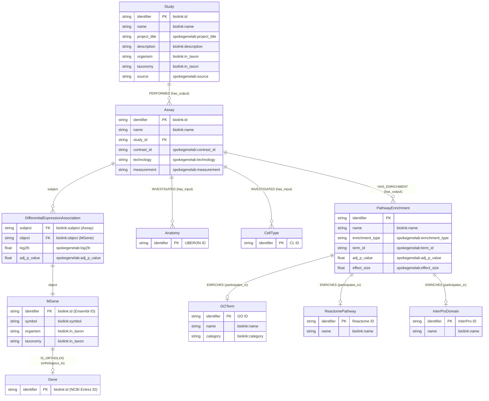

# GEA Pipeline Documentation

This document describes the Gene Expression Atlas (GEA) pipeline (`scripts/gea/gea_pipeline.py`), its process flow, dependencies, and the RDF schema it generates following the [Biolink Model](https://biolink.github.io/biolink-model/).

---

## Overview

The GEA pipeline processes experiment data from the [EMBL-EBI Gene Expression Atlas](https://www.ebi.ac.uk/gxa/) and transforms it into a knowledge graph format suitable for Neo4j (CSV) or RDF (Turtle) output. The pipeline extracts:

- **Study metadata** from experiment descriptions
- **Assay nodes** representing experimental contrasts
- **Gene expression data** with differential expression measurements
- **Pathway enrichment results** from GSEA analysis (GO, Reactome, InterPro)
- **Anatomical and cell type annotations** from sample metadata

---

## Pipeline Architecture

```
┌─────────────────────────────────────────────────────────────────────────────┐
│                              GEA Pipeline                                    │
├─────────────────────────────────────────────────────────────────────────────┤
│                                                                              │
│  ┌──────────────┐    ┌──────────────┐    ┌──────────────┐                   │
│  │  Input Dir   │───▶│  GEA Parser  │───▶│ GEAExperiment│                   │
│  │  (E-GEOD-*)  │    │              │    │   Object     │                   │
│  └──────────────┘    └──────────────┘    └──────┬───────┘                   │
│                                                  │                           │
│         ┌────────────────────────────────────────┼────────────────────┐      │
│         │                    │                   │                    │      │
│         ▼                    ▼                   ▼                    ▼      │
│  ┌─────────────┐     ┌─────────────┐     ┌─────────────┐     ┌─────────────┐│
│  │   Study     │     │   Assay     │     │   Gene      │     │   GSEA      ││
│  │  Extractor  │     │  Extractor  │     │  Extractor  │     │  Extractor  ││
│  └──────┬──────┘     └──────┬──────┘     └──────┬──────┘     └──────┬──────┘│
│         │                   │                   │                   │       │
│         ▼                   ▼                   ▼                   ▼       │
│  ┌─────────────┐     ┌─────────────┐     ┌─────────────┐     ┌─────────────┐│
│  │   Study     │     │   Assay     │     │   MGene     │     │ Enrichment  ││
│  │   Nodes     │     │   Nodes     │     │   Nodes     │     │   Nodes     ││
│  │             │     │  Anatomy    │     │   Gene      │     │  GO/React/  ││
│  │             │     │  CellType   │     │  Orthologs  │     │  InterPro   ││
│  └──────┬──────┘     └──────┬──────┘     └──────┬──────┘     └──────┬──────┘│
│         │                   │                   │                   │       │
│         └───────────────────┴───────────────────┴───────────────────┘       │
│                                        │                                     │
│                                        ▼                                     │
│                            ┌──────────────────────┐                         │
│                            │  GEAPipelineResult   │                         │
│                            │  (nodes + rels)      │                         │
│                            └──────────┬───────────┘                         │
│                                       │                                      │
│                    ┌──────────────────┼──────────────────┐                  │
│                    ▼                                     ▼                  │
│           ┌────────────────┐                   ┌────────────────┐           │
│           │   CSV Writer   │                   │ Turtle Writer  │           │
│           │   (Neo4j)      │                   │    (RDF)       │           │
│           └────────────────┘                   └────────────────┘           │
│                                                                              │
└─────────────────────────────────────────────────────────────────────────────┘
```

---

## Process Flow

### 1. Load Experiment (`gea_parser.py`)

The pipeline begins by loading a GEA experiment directory containing:

| File Type | Pattern | Description |
|-----------|---------|-------------|
| IDF | `*.idf.txt` | Investigation Description Format - experiment metadata |
| SDRF | `*.condensed-sdrf.tsv` | Sample and Data Relationship Format - sample annotations |
| Config | `*-configuration.xml` | Assay groups and contrast definitions |
| Analytics | `*-analytics.tsv` | Differential expression results per gene |
| GSEA | `*.go.gsea.tsv`, `*.reactome.gsea.tsv`, `*.interpro.gsea.tsv` | Pathway enrichment results |

The parser creates a `GEAExperiment` dataclass containing all parsed metadata.

### 2. Extract Study Nodes (`gea_study_extractor.py`)

Creates a Study node for each experiment with properties:
- `identifier`: Experiment accession (e.g., "E-GEOD-5305")
- `name`: Study name
- `project_title`: Full title from IDF
- `project_type`: "Gene Expression Atlas"
- `description`: Experiment description
- `organism`: Species name
- `taxonomy`: NCBI Taxonomy ID
- `source`: "GEA"

### 3. Extract Assay Nodes (`gea_assay_extractor.py`)

Each **contrast** (comparison between two sample groups) becomes an Assay node:
- `identifier`: `{accession}-{contrast_id}` (e.g., "E-GEOD-5305-g1_g3")
- `name`: Contrast name
- `technology`: "DNA microarray"
- `measurement`: "transcription profiling"
- `reference_group_label` / `test_group_label`: Experimental conditions

Also extracts:
- **Anatomy** proxy nodes (UBERON IDs from sample metadata)
- **CellType** proxy nodes (CL IDs from sample metadata)

### 4. Extract Gene Data (`gea_gene_extractor.py`)

Creates **MGene** (model organism gene) nodes from analytics files:
- `identifier`: Ensembl gene ID
- `symbol`: Gene symbol
- `organism`: Species name
- `taxonomy`: NCBI Taxonomy ID

Creates **Gene** (human ortholog) nodes via ortholog mapping and **MGene-IS_ORTHOLOG-Gene** relationships.

Extracts **differential expression relationships**:
- Assay → MGene with `log2fc` and `adj_p_value` properties
- Filtered by configurable p-value threshold (default: 0.1)

### 5. Extract GSEA Data (`gea_gsea_extractor.py`)

Processes pathway enrichment results to create:

| Node Type | Source | Description |
|-----------|--------|-------------|
| PathwayEnrichment | All GSEA files | Enrichment result linking Assay to Term |
| GOTerm | `*.go.gsea.tsv` | Gene Ontology terms (BP/MF/CC) |
| ReactomePathway | `*.reactome.gsea.tsv` | Reactome pathway identifiers |
| InterProDomain | `*.interpro.gsea.tsv` | InterPro protein domain identifiers |

### 6. Output Generation

#### CSV Output (Neo4j)
- Node files: `output/nodes/{NodeType}_*.csv`
- Relationship files: `output/relationships/{RelType}_*.csv`

#### RDF Output (Turtle)
- Single Turtle file: `output/rdf/gxa_rdf.ttl`
- Uses Biolink Model ontology
- Reifies differential expression as Associations with properties

---

## Module Dependencies

```
scripts/gea/gea_pipeline.py
├── scripts/gea/gea_parser.py          # File parsing (IDF, SDRF, XML, TSV)
├── scripts/gea/gea_study_extractor.py # Study node creation
├── scripts/gea/gea_gene_extractor.py  # Gene/MGene extraction
│   └── notebooks/ortholog_mapper.py   # Human ortholog mapping
├── scripts/gea/gea_assay_extractor.py # Assay/Anatomy/CellType extraction
│   └── notebooks/ontology_mapper.py   # BioPortal ontology lookup
├── scripts/gea/gea_gsea_extractor.py  # GSEA enrichment extraction
├── scripts/common/csv_writer.py       # Neo4j CSV output
├── scripts/common/config.py           # Configuration management
└── scripts/rdf/turtle_writer.py       # RDF Turtle output
    ├── scripts/rdf/rdf_config.py      # Namespace definitions
    └── scripts/rdf/biolink_mapper.py  # Biolink Model mappings
```

### External Dependencies

| Dependency | Purpose |
|------------|---------|
| `pandas` | Data manipulation and CSV I/O |
| `rdflib` | RDF graph construction and Turtle serialization |
| BioPortal API | Ontology term lookup (requires API key) |
| Ortholog databases | MGI/JAX, Ensembl for human ortholog mapping |

---

## RDF Schema Diagram

The following diagram shows the knowledge graph schema generated by the GEA pipeline, following the Biolink Model:



---

## Biolink Model Mapping

The RDF output uses the [Biolink Model](https://biolink.github.io/biolink-model/) ontology for semantic interoperability. All mappings are defined in `scripts/rdf/biolink_mapper.py`.

### Node Type Mappings

| Graph Node | Biolink Class | URI Namespace |
|------------|---------------|---------------|
| Study | `biolink:Study` | `spokegenelab:Study/` |
| Assay | `biolink:Assay` | `spokegenelab:Assay/` |
| MGene | `biolink:Gene` | `ncbigene:` (Ensembl ID) |
| Gene | `biolink:Gene` | `ncbigene:` (Entrez ID) |
| Anatomy | `biolink:AnatomicalEntity` | `uberon:` |
| CellType | `biolink:Cell` | `cl:` |
| PathwayEnrichment | `biolink:Association` | `spokegenelab:Enrichment/` |
| GOTerm | `biolink:BiologicalProcess` / `biolink:MolecularActivity` / `biolink:CellularComponent` | `go:` |
| ReactomePathway | `biolink:Pathway` | `reactome:` |
| InterProDomain | `biolink:ProteinDomain` | `interpro:` |

### Relationship (Predicate) Mappings

| Relationship | Biolink Predicate |
|--------------|-------------------|
| Study-PERFORMED-Assay | `biolink:has_output` |
| Assay-MEASURED_DIFFERENTIAL_EXPRESSION-MGene | `biolink:affects_expression_of` |
| MGene-IS_ORTHOLOG-Gene | `biolink:orthologous_to` |
| Assay-INVESTIGATED-Anatomy | `biolink:has_input` |
| Assay-INVESTIGATED-CellType | `biolink:has_input` |
| Assay-HAS_ENRICHMENT-PathwayEnrichment | `biolink:has_output` |
| PathwayEnrichment-ENRICHES-GOTerm | `biolink:participates_in` |
| PathwayEnrichment-ENRICHES-ReactomePathway | `biolink:participates_in` |
| PathwayEnrichment-ENRICHES-InterProDomain | `biolink:participates_in` |

### Reified Associations

Differential expression relationships are **reified** as Biolink Associations to preserve quantitative properties:

```turtle
spokegenelab:Association/abc123def456
    a biolink:GeneExpressionMixin ;
    biolink:subject spokegenelab:Assay/E-GEOD-5305-g1_g3 ;
    biolink:predicate biolink:affects_expression_of ;
    biolink:object ncbigene:ENSMUSG00000000001 ;
    spokegenelab:log2fc "2.5"^^xsd:float ;
    spokegenelab:adj_p_value "0.001"^^xsd:float .
```

---

## RDF Namespaces

The following namespaces are used in the RDF output (defined in `scripts/rdf/rdf_config.py`):

| Prefix | Namespace URI | Description |
|--------|---------------|-------------|
| `biolink` | `https://w3id.org/biolink/vocab/` | Biolink Model ontology |
| `spokegenelab` | `https://spoke.ucsf.edu/genelab/` | Project-specific namespace |
| `ncbigene` | `https://www.ncbi.nlm.nih.gov/gene/` | NCBI Gene identifiers |
| `ncbitaxon` | `http://purl.obolibrary.org/obo/NCBITaxon_` | NCBI Taxonomy |
| `ensembl` | `http://identifiers.org/ensembl/` | Ensembl identifiers |
| `uberon` | `http://purl.obolibrary.org/obo/UBERON_` | Uber Anatomy Ontology |
| `cl` | `http://purl.obolibrary.org/obo/CL_` | Cell Ontology |
| `go` | `http://purl.obolibrary.org/obo/GO_` | Gene Ontology |
| `reactome` | `https://reactome.org/content/detail/` | Reactome pathways |
| `interpro` | `https://www.ebi.ac.uk/interpro/entry/InterPro/` | InterPro domains |
| `gea` | `https://www.ebi.ac.uk/gxa/experiments/` | Gene Expression Atlas |
| `obo` | `http://purl.obolibrary.org/obo/` | OBO Foundry ontologies |

---

## Usage Examples

### Command Line

```bash
# Process single experiment with RDF output
python -m scripts.main --source gea \
    --input-dir ./data/E-GEOD-5305-gea \
    --rdf \
    --p-value 0.05

# Batch process multiple experiments
python -m scripts.main --source gea \
    --input-dir ./data/gea_experiments/ \
    --csv --rdf

# Skip GSEA extraction (faster)
python -m scripts.main --source gea \
    --input-dir ./data/E-GEOD-5305-gea \
    --rdf --no-gsea
```

### Programmatic Usage

```python
from scripts.gea.gea_pipeline import process_gea_experiment, run_gea_pipeline

# Process single experiment
result = process_gea_experiment(
    experiment_dir="./data/E-GEOD-5305-gea",
    p_value_threshold=0.05,
    include_gsea=True,
    include_orthologs=True,
)

# Access results
print(f"Nodes: {list(result.nodes.keys())}")
print(f"Relationships: {list(result.relationships.keys())}")

# Run full pipeline with output
run_gea_pipeline(
    input_dir="./data/E-GEOD-5305-gea",
    output_dir="./output",
    output_rdf=True,
)
```

---

## Configuration Parameters

| Parameter | Default | Description |
|-----------|---------|-------------|
| `p_value_threshold` | 0.1 | Adjusted p-value cutoff for DE filtering |
| `include_gsea` | True | Include GSEA pathway enrichment |
| `include_orthologs` | True | Map model organism genes to human orthologs |
| `bioportal_apikey` | None | BioPortal API key for ontology mapping |
| `output_csv` | False | Generate Neo4j CSV files |
| `output_rdf` | False | Generate RDF Turtle file |

---

## Biolink Model Compatibility

The schema design follows Biolink Model principles:

1. **Named Things**: All nodes are typed with Biolink classes
2. **Associations**: Relationships with properties use the Association pattern
3. **Standard Predicates**: Relationships use Biolink predicates where available
4. **External Identifiers**: URIs follow standard identifier patterns (CURIE-like)
5. **Semantic Interoperability**: Compatible with other Biolink-compliant knowledge graphs

For programmatic schema generation using Biolink tools, the mappings in `biolink_mapper.py` can be exported or used with the [Biolink Model Toolkit](https://github.com/biolink/biolink-model-toolkit).

---

## SPARQL Query Examples

The following SPARQL queries demonstrate how to interrogate a triple store containing multiple GEA experiments. These queries assume the RDF has been loaded into a SPARQL endpoint (e.g., Apache Jena Fuseki, Blazegraph, GraphDB, or Oxigraph).

### Prefix Declarations

All queries below use these standard prefixes:

```sparql
PREFIX rdf: <http://www.w3.org/1999/02/22-rdf-syntax-ns#>
PREFIX rdfs: <http://www.w3.org/2000/01/rdf-schema#>
PREFIX xsd: <http://www.w3.org/2001/XMLSchema#>
PREFIX biolink: <https://w3id.org/biolink/vocab/>
PREFIX spokegenelab: <https://spoke.ucsf.edu/genelab/>
PREFIX ncbigene: <https://www.ncbi.nlm.nih.gov/gene/>
PREFIX go: <http://purl.obolibrary.org/obo/GO_>
PREFIX uberon: <http://purl.obolibrary.org/obo/UBERON_>
PREFIX cl: <http://purl.obolibrary.org/obo/CL_>
PREFIX reactome: <https://reactome.org/content/detail/>
```

---

### Gene Expression Queries

#### Find experiments where gene CDK2 is upregulated

```sparql
PREFIX biolink: <https://w3id.org/biolink/vocab/>
PREFIX spokegenelab: <https://spoke.ucsf.edu/genelab/>

SELECT ?study ?studyTitle ?assay ?geneSymbol ?log2fc ?pvalue
WHERE {
    # Find differential expression associations
    ?assoc a biolink:GeneExpressionMixin ;
           biolink:subject ?assay ;
           biolink:object ?gene ;
           spokegenelab:log2fc ?log2fc ;
           spokegenelab:adj_p_value ?pvalue .

    # Filter for upregulated (log2fc > 0)
    FILTER(?log2fc > 0)

    # Get gene symbol
    ?gene biolink:symbol ?geneSymbol .
    FILTER(UCASE(?geneSymbol) = "CDK2")

    # Get study information
    ?study biolink:has_output ?assay ;
           biolink:name ?studyTitle .
}
ORDER BY DESC(?log2fc)
```

#### Find experiments where gene CDK2 is significantly upregulated (log2fc > 1, p < 0.05)

```sparql
PREFIX biolink: <https://w3id.org/biolink/vocab/>
PREFIX spokegenelab: <https://spoke.ucsf.edu/genelab/>

SELECT ?study ?studyTitle ?assay ?log2fc ?pvalue
WHERE {
    ?assoc a biolink:GeneExpressionMixin ;
           biolink:subject ?assay ;
           biolink:object ?gene ;
           spokegenelab:log2fc ?log2fc ;
           spokegenelab:adj_p_value ?pvalue .

    ?gene biolink:symbol ?geneSymbol .
    FILTER(UCASE(?geneSymbol) = "CDK2")

    # Stringent filtering
    FILTER(?log2fc > 1.0 && ?pvalue < 0.05)

    ?study biolink:has_output ?assay ;
           biolink:name ?studyTitle .
}
ORDER BY DESC(?log2fc)
```

#### Find all downregulated genes in a specific study

```sparql
PREFIX biolink: <https://w3id.org/biolink/vocab/>
PREFIX spokegenelab: <https://spoke.ucsf.edu/genelab/>

SELECT ?geneSymbol ?log2fc ?pvalue ?assayName
WHERE {
    # Filter by study accession
    ?study biolink:id "E-GEOD-5305" ;
           biolink:has_output ?assay .

    ?assay biolink:name ?assayName .

    ?assoc biolink:subject ?assay ;
           biolink:object ?gene ;
           spokegenelab:log2fc ?log2fc ;
           spokegenelab:adj_p_value ?pvalue .

    ?gene biolink:symbol ?geneSymbol .

    # Downregulated genes
    FILTER(?log2fc < -1.0)
}
ORDER BY ?log2fc
LIMIT 50
```

#### Find the most differentially expressed genes across all experiments

```sparql
PREFIX biolink: <https://w3id.org/biolink/vocab/>
PREFIX spokegenelab: <https://spoke.ucsf.edu/genelab/>

SELECT ?geneSymbol (COUNT(?assoc) AS ?numExperiments)
       (AVG(?log2fc) AS ?avgLog2fc) (MIN(?pvalue) AS ?minPvalue)
WHERE {
    ?assoc biolink:object ?gene ;
           spokegenelab:log2fc ?log2fc ;
           spokegenelab:adj_p_value ?pvalue .

    ?gene biolink:symbol ?geneSymbol .

    # Only significant results
    FILTER(?pvalue < 0.05 && ABS(?log2fc) > 1.0)
}
GROUP BY ?geneSymbol
HAVING (COUNT(?assoc) > 1)
ORDER BY DESC(?numExperiments)
LIMIT 100
```

---

### Pathway Enrichment Queries

#### Find experiments where "immune response" biological process is enriched

```sparql
PREFIX biolink: <https://w3id.org/biolink/vocab/>
PREFIX spokegenelab: <https://spoke.ucsf.edu/genelab/>

SELECT ?study ?studyTitle ?assay ?goTerm ?goName ?pvalue ?effectSize
WHERE {
    # Find pathway enrichments
    ?enrichment a biolink:Association ;
                biolink:object ?goTerm ;
                spokegenelab:adj_p_value ?pvalue .

    # Get GO term name
    ?goTerm biolink:name ?goName .
    FILTER(CONTAINS(LCASE(?goName), "immune response"))

    # Link back to assay and study
    ?assay biolink:has_output ?enrichment .
    ?study biolink:has_output ?assay ;
           biolink:name ?studyTitle .

    # Optional effect size
    OPTIONAL { ?enrichment spokegenelab:effect_size ?effectSize }
}
ORDER BY ?pvalue
```

#### Find experiments enriched for a specific GO term by ID

```sparql
PREFIX biolink: <https://w3id.org/biolink/vocab/>
PREFIX spokegenelab: <https://spoke.ucsf.edu/genelab/>
PREFIX go: <http://purl.obolibrary.org/obo/GO_>

SELECT ?study ?studyTitle ?assay ?pvalue
WHERE {
    # GO:0006955 = immune response
    ?enrichment biolink:object go:0006955 ;
                spokegenelab:adj_p_value ?pvalue .

    ?assay biolink:has_output ?enrichment .
    ?study biolink:has_output ?assay ;
           biolink:name ?studyTitle .
}
ORDER BY ?pvalue
```

#### Find all enriched Reactome pathways across experiments

```sparql
PREFIX biolink: <https://w3id.org/biolink/vocab/>
PREFIX spokegenelab: <https://spoke.ucsf.edu/genelab/>
PREFIX reactome: <https://reactome.org/content/detail/>

SELECT ?pathwayId ?pathwayName (COUNT(?enrichment) AS ?numStudies) (MIN(?pvalue) AS ?bestPvalue)
WHERE {
    ?enrichment a biolink:Association ;
                biolink:object ?pathway ;
                spokegenelab:adj_p_value ?pvalue .

    # Filter for Reactome pathways
    FILTER(STRSTARTS(STR(?pathway), STR(reactome:)))

    ?pathway biolink:name ?pathwayName .
    BIND(REPLACE(STR(?pathway), STR(reactome:), "") AS ?pathwayId)
}
GROUP BY ?pathwayId ?pathwayName
ORDER BY DESC(?numStudies)
LIMIT 50
```

#### Find experiments with overlapping enriched GO terms

```sparql
PREFIX biolink: <https://w3id.org/biolink/vocab/>
PREFIX spokegenelab: <https://spoke.ucsf.edu/genelab/>

SELECT ?goTerm ?goName (COUNT(DISTINCT ?study) AS ?numStudies)
       (GROUP_CONCAT(DISTINCT ?studyId; separator=", ") AS ?studies)
WHERE {
    ?enrichment biolink:object ?goTerm ;
                spokegenelab:adj_p_value ?pvalue .

    FILTER(?pvalue < 0.01)

    ?goTerm biolink:name ?goName .

    ?assay biolink:has_output ?enrichment .
    ?study biolink:has_output ?assay ;
           biolink:id ?studyId .
}
GROUP BY ?goTerm ?goName
HAVING (COUNT(DISTINCT ?study) >= 3)
ORDER BY DESC(?numStudies)
```

---

### Anatomy and Cell Type Queries

#### Find experiments studying a specific tissue (e.g., liver)

```sparql
PREFIX biolink: <https://w3id.org/biolink/vocab/>
PREFIX uberon: <http://purl.obolibrary.org/obo/UBERON_>

SELECT ?study ?studyTitle ?assay ?organism
WHERE {
    # UBERON:0002107 = liver
    ?assay biolink:has_input uberon:0002107 .

    ?study biolink:has_output ?assay ;
           biolink:name ?studyTitle ;
           biolink:in_taxon ?organism .
}
```

#### Find all tissues studied across experiments

```sparql
PREFIX biolink: <https://w3id.org/biolink/vocab/>
PREFIX uberon: <http://purl.obolibrary.org/obo/UBERON_>

SELECT ?anatomy (COUNT(DISTINCT ?study) AS ?numStudies)
WHERE {
    ?assay biolink:has_input ?anatomy .
    FILTER(STRSTARTS(STR(?anatomy), STR(uberon:)))

    ?study biolink:has_output ?assay .
}
GROUP BY ?anatomy
ORDER BY DESC(?numStudies)
```

---

### Count and Summary Queries

#### Count total entities in the knowledge graph

```sparql
PREFIX biolink: <https://w3id.org/biolink/vocab/>

SELECT
    (COUNT(DISTINCT ?study) AS ?numStudies)
    (COUNT(DISTINCT ?assay) AS ?numAssays)
    (COUNT(DISTINCT ?gene) AS ?numGenes)
    (COUNT(DISTINCT ?enrichment) AS ?numEnrichments)
WHERE {
    { ?study a biolink:Study }
    UNION
    { ?assay a biolink:Assay }
    UNION
    { ?gene a biolink:Gene }
    UNION
    { ?enrichment a biolink:Association }
}
```

#### Count studies by organism

```sparql
PREFIX biolink: <https://w3id.org/biolink/vocab/>

SELECT ?organism (COUNT(?study) AS ?numStudies)
WHERE {
    ?study a biolink:Study ;
           biolink:in_taxon ?organism .
}
GROUP BY ?organism
ORDER BY DESC(?numStudies)
```

#### Count differential expression associations per study

```sparql
PREFIX biolink: <https://w3id.org/biolink/vocab/>
PREFIX spokegenelab: <https://spoke.ucsf.edu/genelab/>

SELECT ?studyId ?studyTitle (COUNT(?assoc) AS ?numDEGenes)
WHERE {
    ?study a biolink:Study ;
           biolink:id ?studyId ;
           biolink:name ?studyTitle ;
           biolink:has_output ?assay .

    ?assoc biolink:subject ?assay ;
           spokegenelab:log2fc ?log2fc .
}
GROUP BY ?studyId ?studyTitle
ORDER BY DESC(?numDEGenes)
```

#### Count genes by direction of expression change

```sparql
PREFIX biolink: <https://w3id.org/biolink/vocab/>
PREFIX spokegenelab: <https://spoke.ucsf.edu/genelab/>

SELECT
    (SUM(IF(?log2fc > 0, 1, 0)) AS ?upregulated)
    (SUM(IF(?log2fc < 0, 1, 0)) AS ?downregulated)
    (COUNT(*) AS ?total)
WHERE {
    ?assoc spokegenelab:log2fc ?log2fc ;
           spokegenelab:adj_p_value ?pvalue .
    FILTER(?pvalue < 0.05)
}
```

#### Summary statistics for a specific study

```sparql
PREFIX biolink: <https://w3id.org/biolink/vocab/>
PREFIX spokegenelab: <https://spoke.ucsf.edu/genelab/>

SELECT ?studyId
    (COUNT(DISTINCT ?assay) AS ?numContrasts)
    (COUNT(DISTINCT ?gene) AS ?numDEGenes)
    (COUNT(DISTINCT ?goTerm) AS ?numEnrichedGOTerms)
    (AVG(ABS(?log2fc)) AS ?avgAbsLog2fc)
WHERE {
    ?study biolink:id "E-GEOD-5305" ;
           biolink:has_output ?assay .

    BIND("E-GEOD-5305" AS ?studyId)

    OPTIONAL {
        ?assoc biolink:subject ?assay ;
               biolink:object ?gene ;
               spokegenelab:log2fc ?log2fc .
    }

    OPTIONAL {
        ?enrichment biolink:object ?goTerm .
        ?assay biolink:has_output ?enrichment .
        FILTER(CONTAINS(STR(?goTerm), "GO_"))
    }
}
GROUP BY ?studyId
```

---

### Cross-Experiment Analysis Queries

#### Find genes differentially expressed in multiple experiments

```sparql
PREFIX biolink: <https://w3id.org/biolink/vocab/>
PREFIX spokegenelab: <https://spoke.ucsf.edu/genelab/>

SELECT ?geneSymbol
       (COUNT(DISTINCT ?study) AS ?numStudies)
       (GROUP_CONCAT(DISTINCT ?studyId; separator=", ") AS ?studies)
       (AVG(?log2fc) AS ?meanLog2fc)
WHERE {
    ?assoc biolink:object ?gene ;
           biolink:subject ?assay ;
           spokegenelab:log2fc ?log2fc ;
           spokegenelab:adj_p_value ?pvalue .

    ?gene biolink:symbol ?geneSymbol .

    ?study biolink:has_output ?assay ;
           biolink:id ?studyId .

    # Only significant
    FILTER(?pvalue < 0.05 && ABS(?log2fc) > 1.0)
}
GROUP BY ?geneSymbol
HAVING (COUNT(DISTINCT ?study) >= 2)
ORDER BY DESC(?numStudies)
LIMIT 100
```

#### Find gene-pathway associations across experiments

```sparql
PREFIX biolink: <https://w3id.org/biolink/vocab/>
PREFIX spokegenelab: <https://spoke.ucsf.edu/genelab/>

SELECT ?geneSymbol ?pathwayName
       (COUNT(DISTINCT ?study) AS ?coOccurrences)
WHERE {
    # Gene is differentially expressed in assay
    ?deAssoc biolink:subject ?assay ;
             biolink:object ?gene ;
             spokegenelab:adj_p_value ?dePvalue .
    FILTER(?dePvalue < 0.05)

    ?gene biolink:symbol ?geneSymbol .

    # Pathway is enriched in same assay
    ?assay biolink:has_output ?enrichment .
    ?enrichment biolink:object ?pathway ;
                spokegenelab:adj_p_value ?pathwayPvalue .
    FILTER(?pathwayPvalue < 0.05)

    ?pathway biolink:name ?pathwayName .

    ?study biolink:has_output ?assay .
}
GROUP BY ?geneSymbol ?pathwayName
HAVING (COUNT(DISTINCT ?study) >= 2)
ORDER BY DESC(?coOccurrences)
LIMIT 50
```

---

### Python Example: Running Queries with rdflib

```python
from rdflib import Graph

# Load the RDF graph
g = Graph()
g.parse("output/rdf/gxa_rdf.ttl", format="turtle")

# Define query for upregulated CDK2
query = """
PREFIX biolink: <https://w3id.org/biolink/vocab/>
PREFIX spokegenelab: <https://spoke.ucsf.edu/genelab/>

SELECT ?study ?geneSymbol ?log2fc ?pvalue
WHERE {
    ?assoc biolink:subject ?assay ;
           biolink:object ?gene ;
           spokegenelab:log2fc ?log2fc ;
           spokegenelab:adj_p_value ?pvalue .

    ?gene biolink:symbol ?geneSymbol .
    FILTER(UCASE(?geneSymbol) = "CDK2" && ?log2fc > 0)

    ?study biolink:has_output ?assay .
}
ORDER BY DESC(?log2fc)
"""

# Execute and print results
results = g.query(query)
for row in results:
    print(f"Study: {row.study}")
    print(f"  Gene: {row.geneSymbol}, Log2FC: {row.log2fc}, P-value: {row.pvalue}")
```

---

## See Also

- [Biolink Model Documentation](https://biolink.github.io/biolink-model/)
- [Gene Expression Atlas](https://www.ebi.ac.uk/gxa/)
- [SPOKE Knowledge Graph](https://spoke.ucsf.edu/)
- [Main README](../README.md)
